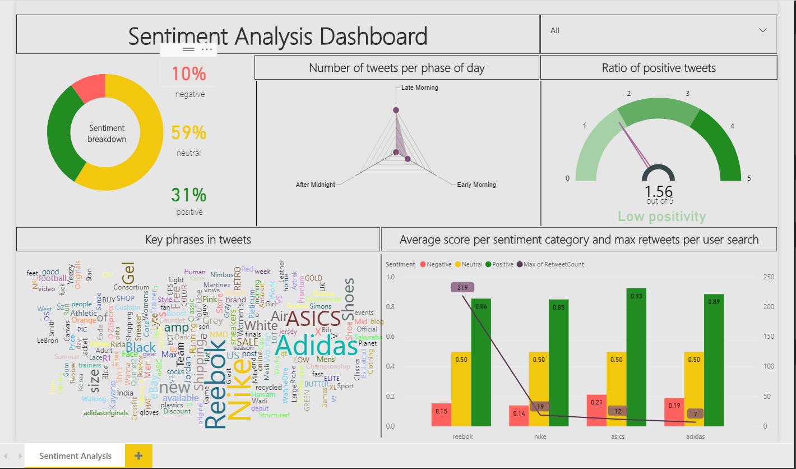

# Twitter Sentiment Analysis

This is a ASP.NET MVC application which aims at providing the user insights into the tweets related to a subject.


## Application workflow
1. User is able to search for a subject in the application
2. The engine will make use of Twitter's Search API to retrieve tweets about the underlying subject
3. Once the tweets have been retrieved, the engine will try to get insights about them. This is done by calling Microsoft's [Text Analytics API](https://azure.microsoft.com/en-in/services/cognitive-services/text-analytics/), part of the Cognitive Services collection, mainly for the following:
- [Sentiment Analysis](https://docs.microsoft.com/en-in/azure/cognitive-services/text-analytics/how-tos/text-analytics-how-to-sentiment-analysis)
- [Key Phrase Extraction](https://docs.microsoft.com/en-in/azure/cognitive-services/text-analytics/how-tos/text-analytics-how-to-keyword-extraction)
4. The retrieved insights will be stored in the database. The data in the database will be presented to the end-user through a Power BI Dashboard.

## Setup
1. Clone the repo.

### Database setup
2. Create a new database called **DEV_DB_LIC** in SQL Server 2014 or later.

In order to ease the database setup, please use the SQL scripts stored in [database_scripts](/database_scripts) to:
- create the database
- create the tables
- create the stored procedures needed by the solution
- populate the dictionaries in the solution

### Web Solution Setup

3. Open the **SocialMediaQuery** solution using Visual Studio 2015 or later.
4. Edit the **ConnectionStrings.config** file to point to your newly created database:

```
<connectionStrings>
  <add name="DEV_DB_LICEntities2" connectionString="" providerName="System.Data.EntityClient" />
</connectionStrings>
```

4. Edit the **TwitterConsumerKey** and the **TwitterConsumeSecret** keys in the **PrivateSettings.config** file:

```
<appSettings>
  <add key="TwitterConsumerKey" value="Your Twitter Client Key Here" />
  <add key="TwitterConsumerSecret" value="Your Twitter Consumer Secret Here" />
  ...
</appSettings>
```

5. Edit the **CognitiveServicesKey** key in the **Web.config** file:

```
<appSettings file="PrivateSettings.config">
  ...
  <add key="CognitiveServicesKey" value="Your Cognitive Services Key Here" />
</appSettings>
```

### Power BI Setup

6. Create a **Power BI Dashboard** like in the following example by connecting to your database:


7. Publish the dashboard in a Power BI workspace.

8. Change the **SocialMediaQuery** solution to show your dashboard by editing:
- **iframe object** at line 49 in the **Details.cshtml** file:
```
 ...
    <div class="row">
        <div class="col-lg-3">
            <span class="pull-left">
                <input type="button" value="Go to Report" class="btn btn-info btn-flat" onclick="@("window.location.href='" + @Url.Action("RedirectToReport", "Results") + "'");" />
            </span>
        </div>
    </div>

    <br />

    <iframe width="933" height="700" src="https://app.powerbi.com/view?r=eyJrIjoiMGJlYWZhZjgtMmEyYy00MDVmLThkOTktYTQ3MTg2MzlhNjBhIiwidCI6ImI3MWNlN2IzLTQyM2EtNGQ3ZS1hMjcwLWUwZjdjZjIzNDVmZSIsImMiOjh9" frameborder="0" allowFullScreen="true"></iframe>

    <table class="table">
...
```

- **report url** at line 171 in the **ResultsController.cs** file:
```
...
        public ActionResult RedirectToReport()
        {
            return Redirect("https://app.powerbi.com/groups/me/reports/5ff3f7d9-ee08-444e-a669-5be0f50aa674/ReportSection976e31ccf6b26e138cf5");
        }
...
```

## Shoutout

1. To CodingMag.com (https://www.youtube.com/channel/UC3eBGYprHl6nK29YqNfYYpA) for publishing an open-source solution to connect to social media platforms like Twitter, Instagram, Google+
